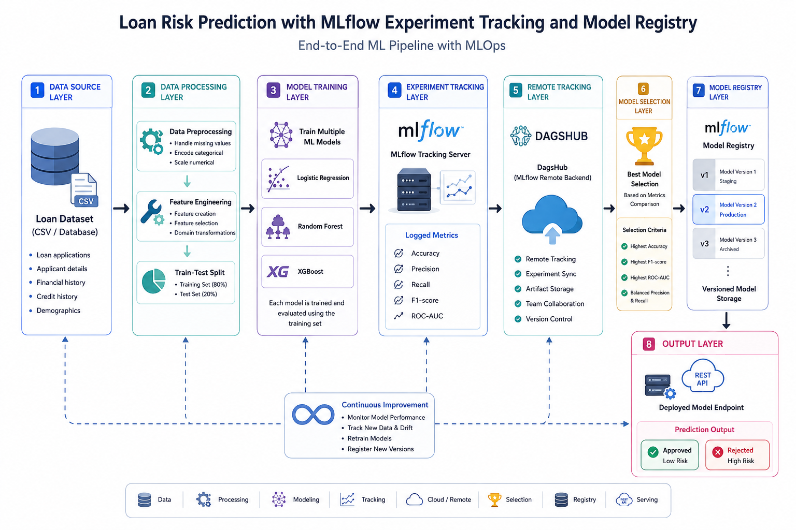
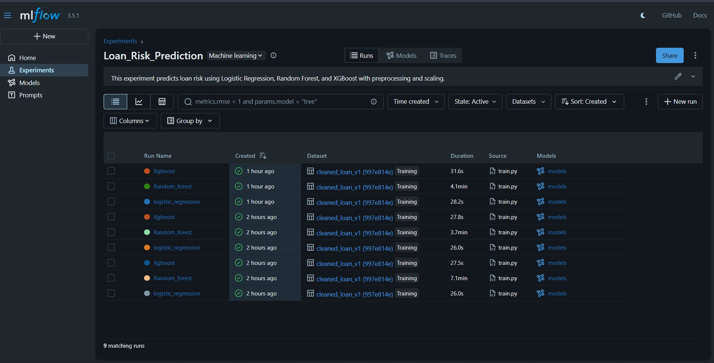
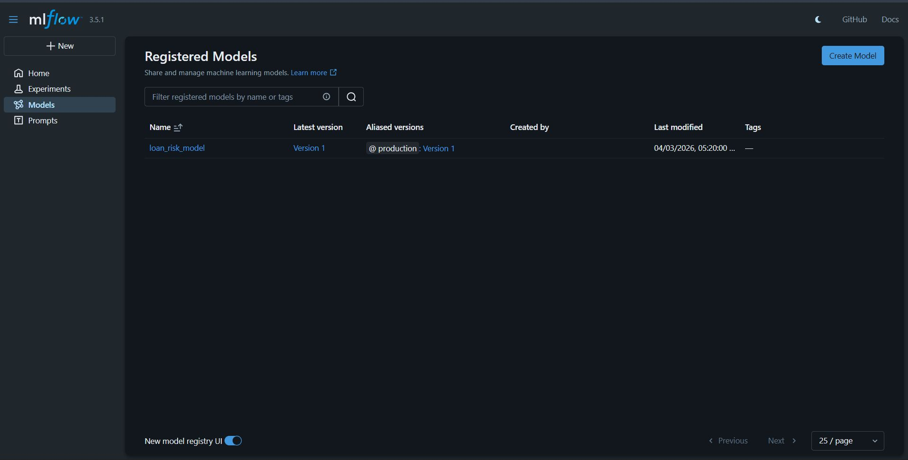
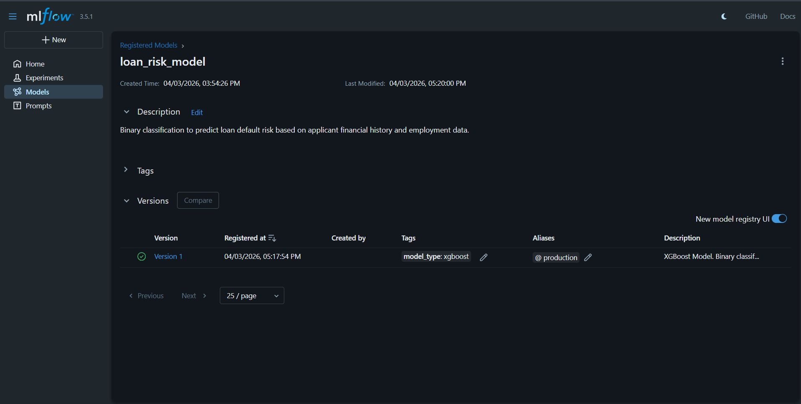
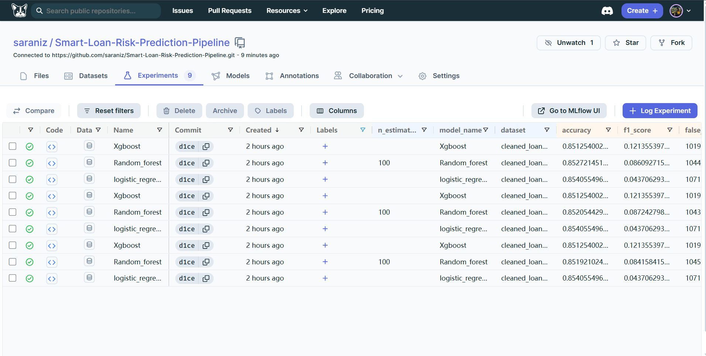
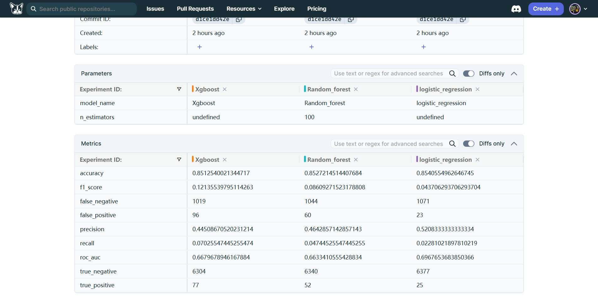
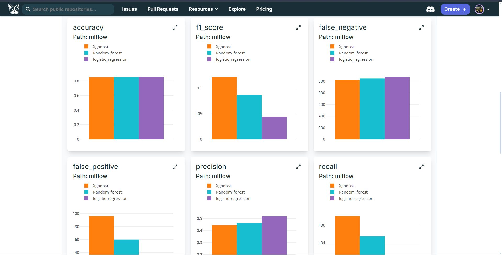

# 📈 Machine Learning Project: Loan Risk Prediction with MLflow Experiment Tracking & Model Registry

Built an end-to-end machine learning pipeline for loan risk prediction by training multiple classification models and managing the complete experiment lifecycle using MLflow.

The workflow started by training and evaluating Logistic Regression, Random Forest, and XGBoost models on the same dataset to ensure fair comparison. Each run was tracked using MLflow, where key metrics such as accuracy, precision, recall, F1-score, and ROC-AUC were logged to analyze model performance in a structured way.

To make the system more robust and production-ready, DagsHub was integrated as a remote MLflow tracking backend. This allowed all experiment runs to be stored centrally, making the results reproducible and accessible across environments.

After comparing all models, the best performing model was selected and registered using MLflow Model Registry. This step ensured proper versioning of the model and created a clear pathway for future deployment and lifecycle management.

## 🔗 Project Repositories
- **GitHub Repository:** [Smart-Loan-Risk-Prediction-Pipeline](https://lnkd.in/grcARy25)
- **DagsHub Repository:** [Smart-Loan-Risk-Prediction-Pipeline on DagsHub](https://lnkd.in/gNUJ3UJX)

---

## 📐 Pipeline Architecture



---

## 🧠 What I Learned
- How to structure and manage multiple ML experiments in a consistent workflow
- How MLflow helps in tracking, comparing, and analyzing model performance effectively
- How remote tracking (DagsHub) improves reproducibility and collaboration in ML projects
- How model registry enables version control and prepares models for deployment
- How an end-to-end ML pipeline moves from training → tracking → selection → registration

---

## 📁 Project Structure

- `data/`
  - `financial_loan.csv` (raw dataset)
  - `cleaned_loan.csv` (cleaned dataset generated by ETL)
- `src/`
  - `etl.py` (cleaning + feature engineering)
  - `train.py` (training + MLflow logging + model registration)

---

## ⚙️ Data Pipeline (ETL)

The ETL script in `src/etl.py` performs:
- Column selection for important risk features
- Missing-value handling:
  - Numeric columns filled with column means
  - Categorical columns filled with `Unknown`
- Employment length parsing into numeric values
- New feature creation:
  - `installment_income_ratio = (installment * 12) / (annual_income + 1)`
- Loan status transformation into binary target label
- Removal of non-final loan states such as *Current*
- Saving cleaned data to `data/cleaned_loan.csv`

To run ETL:
```bash
cd src
python etl.py
```

---

## 🏋️ Model Training

The training script in `src/train.py`:
- Loads cleaned data from `data/cleaned_loan.csv`
- Applies one-hot encoding to categorical variables
- Splits data into train/test sets
- Scales features using `StandardScaler`
- Trains and evaluates:
  - Logistic Regression
  - Random Forest
  - XGBoost
- Logs parameters, metrics, dataset, and model artifacts to MLflow

Tracked metrics include:
- `accuracy`
- `precision`
- `recall`
- `f1_score`
- `roc_auc`
- Confusion matrix components (`tn`, `fp`, `fn`, `tp`)

To run training:
```bash
cd src
python train.py
```

---

## 📊 MLflow Experiment Tracking

This project uses MLflow for experiment tracking:
- **Tracking URI:** `sqlite:///mlflow.db`
- **Experiment name:** `Loan_Risk_Prediction`
- Per-model run logging and model artifact logging using `mlflow.sklearn.log_model`

To open the MLflow UI:
```bash
cd src
mlflow ui --backend-store-uri sqlite:///mlflow.db
```

### MLflow UI Screenshot
*Local Experiment Runs Dashboard:*


---

## 🗃️ Model Registry

After training, the best model run is registered automatically to MLflow Model Registry:
- **Registered model name:** `loan_risk_model`
- Registration is done with model URI format `runs:/<run_id>/model` via `mlflow.register_model(...)`

### Model Registry Screenshots
*Registered Models List:*


*Model Version Details:*


---

## ☁️ DagsHub Remote Tracking

DagsHub is integrated as the remote MLflow tracking backend for storing runs centrally, ensuring reproducibility, and enabling collaboration.

### DagsHub Screenshots
*Remote Experiments runs dashboard:*


*Parameter and Metric Side-by-Side Comparison:*


*Metrics Visualized as Bar Charts:*

